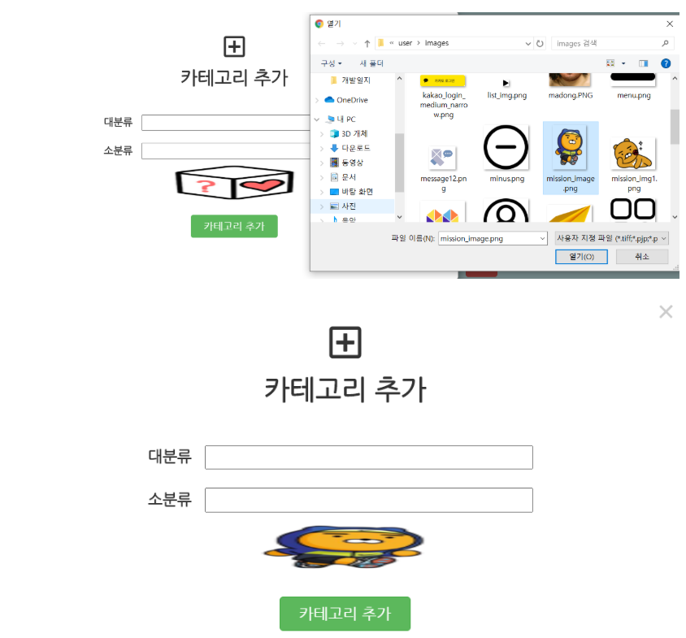

## 7/13(월)  

### 관리자 페이지

-----------

#### 1. 카테고리 관리 게시판 - 카테고리 이미지 추가

- 카테고리에 따라서 카테고리 이미지를 추가 할 수 있는 기능
- 파일을 업로드 하면 파일이미지 미리보기 할 수 있다.  

###### < mission_category_insert.jsp >

```jsp
<script>
    $(document).ready(function () {
        $('#upload').change(function (e) {
            $('#auth_image').attr('src', URL.createObjectURL(e.target.files[0]));
        })
    });
</script>

....

<li>
   
</li>
<li>
  <input id="upload" class="file_upload" name="category_image" 
     type="file" accept="image/*, video/*" capture="camera" style="display: none">
</li>
```



- 기존 이미지를 클릭하면 업로드 창이 뜨고 선택한 이미지로 바뀐다.


###### < 업로드 DB처리 >

- MultipartHttpServletRequest 로 받아서 사용 -> 

  기존의 HttpServletRequest 로 request를 받을수 없다

- 카테고리 이미지는 단일 파일만 사용하므로 getFile 사용

- 파일 이름이 한글일 경우 utf - 8 인코딩 필요

- 원하는 파일의 이름으로 저장하기 위해 getExtension 사용

###### < ManageCategoryInsertPro >

```java
String path = "C:/test2/";

MultipartHttpServletRequest mpr = (MultipartHttpServletRequest) request;

MultipartFile file = mpr.getFile("category_image");

String large_category = mpr.getParameter("largeCategory");
large_category = new String(large_category.getBytes("8859_1"), "utf-8");
String small_category = mpr.getParameter("smallCategory");
small_category = new String(small_category.getBytes("8859_1"), "utf-8");

String originName = file.getOriginalFilename();
String extension = "."+FilenameUtils.getExtension(originName);
String newFile = path + large_category + small_category + extension;
String newFileName = large_category + small_category + extension;
file.transferTo(new File(newFile));
```


- 원하는 위치에 (C:/test2) 원하는 파일명으로 저장 확인


----

### 유저 페이지

---

#### 2. 유저 메인 페이지 - 미션 받기 기능

- 미션 난이도 (일반, 챌린지)  /  카테고리 선택 (전체, 관심)
- 모달창으로 미션난이도, 카테고리 선택 가능

```jsp
<!-- 미션받기 버튼 -->
<div id="flip" class="slider"></div>

<section id="panel" class="mission-select">
    <input id="mission_level" type="hidden" value="normal">
    <input id="mission_categoryArea" type="hidden" value="my">
    <div class="col">
        <button class="btn-nomal" type="button" 
                onclick="NormalBtnClick()">일반 미션</button>
        <button class="btn-challenge" type="button" 
                onclick="ChallengeBtnClick()">챌린지 미션</button>
    </div>
    <div id="modal-bg" class="modal-bg" onclick="CloseModal()">
        <div class="modal-body">
            <button class="myCategory" type="button" 
                    onclick="InterestBtnClick()">관심분야</button>
            <button class="allCategory" type="button" 
                    onclick="AllCategoryBtnClick()">전체분야</button>
        </div>
    </div>
</section>
```

```javascript
//관심분야버튼 클릭시 input 값 변경
function InterestBtnClick() {
    var mission_level = document.getElementById('mission_level').value;
    var mission_categoryArea = 
        document.getElementById('mission_categoryArea');
    mission_categoryArea.value='my';
    
    location.href = 'user_missionGetPro.do?mission_level='+mission_level+'&mission_categoryArea='+mission_categoryArea.value;
}

//전체분야버튼 클릭시 input 값 변경
function AllCategoryBtnClick() {
    var mission_level = document.getElementById('mission_level').value;
    var mission_categoryArea = document.getElementById('mission_categoryArea');
    mission_categoryArea.value='all';

    location.href='user_missionGetPro.do?mission_level='+mission_level+'&mission_categoryArea='+mission_categoryArea.value;
}
```


- 미션 난이도 (일반, 챌린지)  /  카테고리 선택 (전체, 관심) 을 hidden 값에 담아서 

  핸들러 페이지로 넘긴다.

- 일반, 전체 / 일반, 관심 / 챌린지, 전체 / 챌린지, 관심 4가지 경우로 나누어서 

  DB처리 예정.

###### < UserMissionGetPro.java >

```java
request.setCharacterEncoding("utf-8");
String mission_level= request.getParameter("mission_level");
String mission_categoryArea = request.getParameter("mission_categoryArea");

if(mission_level.equals("normal")) {
    if(mission_categoryArea.equals("all")) {

    } else {

    }
} else { 
    if(mission_categoryArea.equals("all")) {
        
    } else {

    }

}
```


-----------

#### 3.  회원가입 - 실시간 닉네임 중복확인

- 회원가입 페이지에서 실시간으로 닉네임 중복확인을 실행 

- data 값을 json 형식으로 가져왔지만 사용 할 수 없었다. (data.result)

  ```javas
  {
  	result :  ${result}
  }
  ```

- data 값을 사용할 수 있도록 문자열을 코드로 인식할 수 있는 함수를 사용하여 해결 

```javascript
data=eval('(' + data + ')');
```

###### <user_join.jsp>

```jsp
<li>
    <label class="th">* 닉네임</label>
	<label><input class="form-control" type="text" name="user_nickname" 				     			id="user_nickname" placeholder="insert into your nickname"></label>
	<div class="checkResult" id="nicknameCheck"></div>
</li>
```

###### <user_join.jsp>

```jsp
<script>
$(document).ready(function(){ //닉네임 중복확인
    $('#user_nickname').on('keyup',function(event){
        $.ajax(
            {
                type : 'POST',
                url : 'nicknameCheck.do',
                data :{
                    user_nickname : $('#user_nickname').val()
                },
                dataType : 'text',
                async : false,
                success : function(data){
                    data=eval('(' + data + ')');
                    if($("#user_nickname").val()==null ||$("#user_nickname").val()==""){
                        $("#nicknameCheck").text("닉네임을 입력해주세요.");
                        $("#nicknameCheck").css("color","red");
                        $("reg_submit").attr("disabled",true);
                    }else if(data.result==1){
                        //1: 아이디가 중복되는 문구
                        $("#nicknameCheck").text("사용중인 닉네임입니다.");
                        $("#nicknameCheck").css("color","red");
                        $("reg_submit").attr("disabled",true);
                    }else if(data.result==0){
                        $("#nicknameCheck").text("사용 가능한 닉네임입니다.");
                        $("#nicknameCheck").css("color","red");
                        $("reg_submit").attr("disabled",true);
                    }
                },
                error : function(e){
                }
            }
        );
    });
});
//-->
</script>
```

###### <NicnameCheck.java>


```java
package handler.user.member;

import javax.annotation.Resource;
import javax.servlet.http.HttpServletRequest;
import javax.servlet.http.HttpServletResponse;

import org.springframework.stereotype.Controller;
import org.springframework.web.bind.annotation.RequestMapping;
import org.springframework.web.servlet.ModelAndView;

import handler.CommandHandler;
import user.member.UserMemberDao;

@Controller
public class NicknameCheck implements CommandHandler{
	@Resource 
	UserMemberDao userMemberDao;
	
	@RequestMapping("/nicknameCheck")
	@Override
	public ModelAndView process(HttpServletRequest request, HttpServletResponse response) throws Exception {
		request.setCharacterEncoding("utf-8");

		String user_nickname = request.getParameter("user_nickname");
		
		int result =userMemberDao.nicknameCheck(user_nickname);
		
		request.setAttribute("user_nickname",user_nickname);
		request.setAttribute("result",result);
		
		return new ModelAndView("user/pages/nicknameCheck");
	}
}
```
###### <nicknameCheck.jsp>

```jsp
<%@ page contentType="text/html;charset=UTF-8" language="java" %>
<%@ include file="user_settings.jsp" %>

<%@ taglib prefix="c" uri="http://java.sun.com/jsp/jstl/core" %>
<%@ taglib prefix="sql" uri="http://java.sun.com/jsp/jstl/sql" %>

{
	result :  ${result}
}
```


----------

#### 4. 로그인 페이지 - 카카오 API

- 카카오 API를 이용하여 사용자 정보를 받아옴 
- 사용자 정보를 받아오기 위한 url 코드에서 404 에러가 발생하여  버전 변경을 통하여 해결

```javascript
url: '/v1/user/me' //수정 전 
url: '/v2/user/me' //수정 후 
```

######     <user_index.jsp>

```jsp
<script type="text/javascript">
  //<![CDATA[  
  // input your appkey
    Kakao.init('2e0dd9cdd18563c11119c90254fc687a')
    Kakao.Auth.createLoginButton({

   container: '#create-kakao-login-btn',
   success: function(authObj) {
     Kakao.API.request({
       url: '/v2/user/me',
       success: function(res) {
             alert(JSON.stringify(res)); 
             alert(JSON.stringify(authObj)); 
             console.log(res.kakao_account['email']);//o
             console.log(res.properties['nickname']); 
             console.log(res.properties['profile_image']); //o
             console.log(res.properties['thumbnail_image']); 
             console.log(res.id); //o
             console.log(res.kakao_account['age_range']);  //o
             console.log(res.kakao_account['birthday']);  //o
             console.log(res.kakao_account['gender']); //o
             console.log(authObj.access_token); //o
             console.log(authObj.refresh_token);
             
             var user_email = res.kakao_account['email'] ;
             var profile_picture = res.properties['profile_image'];
             var kakao_id = res.id;
             var age_group = res.kakao_account['age_range'] ;
             var kakao_birthday = res.kakao_account['birthday'];
             var gender = res.kakao_account['gender'];
             var kakao_access_token = authObj.access_token;
             
             location.href="user_loginPro.do?user_email="+ user_email + "&profile_picture=" + profile_picture + "&kakao_id=" + kakao_id
            		 +"&age_group=" + age_group + "&kakao_birthday=" + kakao_birthday + "&gender=" + gender + "&kakao_access_token=" + kakao_access_token;
           }
         })
       },
       fail: function(error) {
         alert(JSON.stringify(error));
       }
     });
//]]>
</script>
```

=>콘솔에 나오는 사진 넣기 


-----

