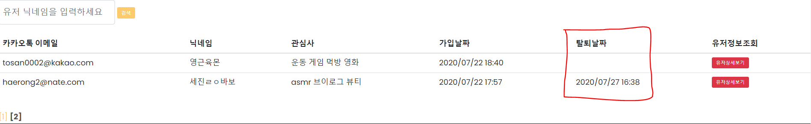
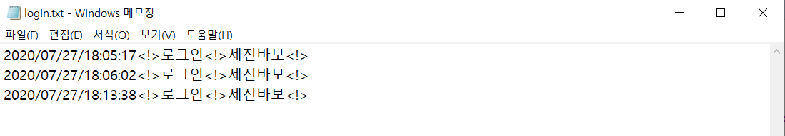

## 7/27(월)  

### 유저 페이지

-----------

#### 1. 신고페이지  - 댓글 신고 

- (완성) 댓글의 메뉴 버튼을 클릭 시 모달창으로 신고하기 페이지로 이동 가능
- (미완성) 게시글 신고 처리


###### <user_content.jsp> : 신고하기 페이지 이동을 위한 모달창 띄우기

```jsp
<li><span class="text-danger" onclick="doReport($('#reply_id').val(),$('#success_board_id').val())">신고하기</span></li>

<script>
function doReport(reply_id,success_board_id){
	   alert(reply_id);
	   location.href="user_report.do?reply_id="+reply_id+"&success_board_id="+success_board_id;
   }
</script>
```


- (완성) DB의 신고 내역을 저장


###### <UserReport.java>

```java
package handler.user.missionsuccessboard;

import javax.annotation.Resource;
import javax.servlet.http.HttpServletRequest;
import javax.servlet.http.HttpServletResponse;

import org.springframework.stereotype.Controller;
import org.springframework.web.bind.annotation.RequestMapping;
import org.springframework.web.servlet.ModelAndView;

import Dtos.ReplyDto;
import handler.CommandHandler;
import user.successboard.UserSuccessBoardDao;

@Controller
public class UserReport implements CommandHandler{
	
	@Resource
	private UserSuccessBoardDao userSuccessBoardDao;
	@RequestMapping("/user_report")
	@Override
	public ModelAndView process(HttpServletRequest request, HttpServletResponse response) throws Exception {
		String reported_reply_id = request.getParameter("reply_id");
		String success_board_id = request.getParameter("success_board_id");
		
		ReplyDto replyDto = userSuccessBoardDao.selectInfo(reported_reply_id);
		String reported_nickname = replyDto.getUser_nickname();
		
		request.setAttribute("reported_nickname", reported_nickname);
		request.setAttribute("reported_reply_id", reported_reply_id);
		request.setAttribute("success_board_id", success_board_id);
		return new ModelAndView("user/pages/user_report");
	}
}
```

###### <user_report.jsp> : 신고 Form

```jsp
<%@ page contentType="text/html;charset=UTF-8" language="java" %>
<%@ include file="user_settings.jsp" %>
<html>
<head>
    <meta charset="utf-8">
    <meta http-equiv="X-UA-Compatible" content="IE=edge">
    <meta name="viewport" content="width=device-width, initial-scale=1">
    <link type="text/css" rel="stylesheet" href="${project}asset/user.css">
    <link rel="stylesheet" href="https://maxcdn.bootstrapcdn.com/bootstrap/3.3.2/css/bootstrap.min.css">
    <script src="${project}asset/script.js"></script>
    <script src="https://ajax.googleapis.com/ajax/libs/jquery/3.5.1/jquery.min.js"></script>
    <script src="https://maxcdn.bootstrapcdn.com/bootstrap/3.3.2/js/bootstrap.min.js"></script>
    <script src="https://kit.fontawesome.com/23971e572d.js" crossorigin="anonymous"></script>
    <title>유저 신고 페이지</title>
</head>
<body>
	<div class="container">
        <header>
            
	            <div id="menu_list" class="menu_list">
		            	<span onclick="GoMainPage()">Logout</span>
		            	<br><br>
		            	<span>Withdrawal</span>
		        </div>
            
        </header>
	   <form method="post" name="user_reportForm" action="user_reportPro.do">
	   	   <input type="hidden" name="reported_reply_id" value="${reported_reply_id}">
	       <input type="hidden" name="reported_nickname" value="${reported_nickname}">
	       <input type="hidden" name="success_board_id" value="${success_board_id}">
	       
	        
	        <article class="reportArticle">
	        	<section class="reportSection">
		        	<div style="padding:10px;">
		        		<span>댓글/게시글 신고</span>
		        	</div>
		       		<div class="reportProfile">
		       			<div class="contentProfile">
		       				
			            	<span>${reported_nickname}</span>
			            </div>
		       		</div>
		       		<section style="margin-top: 20px;">
		       			<div>
		       				<select class="form-control" name="reportType">
		       					<option value="욕설">욕설</option>
		       					<option value="혐오 발언">혐오 발언</option>
		       					<option value="차별 ">차별</option>
		       					<option value="비방">비방</option>
		       					<option value="기타">기타</option>
		       				</select>
		       			</div>
		       			<div style="margin-top: 15px">
		       				<textarea class="reportWrite" name="reportReason"></textarea>
		       			</div>
		       			<div style="margin-top: 30px">
		       				<button type="submit" class="profilemodifybtn">확인</button>
		       				<button onclick="history.go(-1)" type="button" class="profilemodifybtn">취소</button>
		       			</div>
		       			<div style="margin-top: 24px">
		       				<a style="font-size: 1px;">※허위신고일 경우, 신고자는 서비스 이용이 제한됩니다.</a>
		       			</div>
		       		</section>
	        	</section>
	        </article>
	    </form>
	    </div> 
      <script type="text/javascript">
		//<!--
      	$(document).ready(function(){
		  $("#menu").click(function(){
		    $("#menu_list").slideToggle("slow");
		  });
		});
   		//-->
	</script>
</body>
</html>
```

###### <UserReportPro.java> 

```java
package handler.user.missionsuccessboard;

import javax.annotation.Resource;
import javax.servlet.http.HttpServletRequest;
import javax.servlet.http.HttpServletResponse;

import org.springframework.stereotype.Controller;
import org.springframework.web.bind.annotation.RequestMapping;
import org.springframework.web.servlet.ModelAndView;


import Dtos.ReportBoardDto;
import handler.CommandHandler;
import user.successboard.UserSuccessBoardDao;

@Controller
public class UserReportPro implements CommandHandler{
	
	@Resource
	private UserSuccessBoardDao userSuccessBoardDao;
	@RequestMapping("/user_reportPro")
	@Override
	public ModelAndView process(HttpServletRequest request, HttpServletResponse response) throws Exception {
		request.setCharacterEncoding("utf-8");
		String report_user_nickname = (String) request.getSession().getAttribute("user_nickname");
		
		//댓글 신고 
		String reported_reply_id = request.getParameter("reported_reply_id");
		String report_type = request.getParameter("reportType");
		String report_reason = request.getParameter("reportReason");
		String reported_nickname = request.getParameter("reported_nickname");
		String success_board_id = request.getParameter("success_board_id");
		
		//댓글 신고
		ReportBoardDto reportBoardDto = new ReportBoardDto();
		reportBoardDto.setReport_user_nickname(report_user_nickname);
		reportBoardDto.setReported_nickname(reported_nickname);
		reportBoardDto.setReport_type(report_type);
		reportBoardDto.setReport_reason(report_reason);
		reportBoardDto.setReported_reply_id(reported_reply_id);
		
		
		int result = userSuccessBoardDao.insertReportReply(reportBoardDto);
		
		request.setAttribute("success_board_id", success_board_id);
		request.setAttribute("result", result);
		return new ModelAndView("user/pages/user_reportPro");
	}
}
```

###### <user_reportPro.jsp>

- 선택된 게시판으로 이동을 위하여 success_board_id를 불러 옴 

```jsp
<meta http-equiv="refresh" content="0;url=user_content.do?success_board_id=${success_board_id}">
```

```jsp
<%@ page contentType="text/html;charset=UTF-8" language="java" %>
<%@ include file="user_settings.jsp" %>
<html>
<head>
    <title>유저정보 수정 처리 페이지</title>
</head>
<body>
    <h2>유저정보 수정 처리 페이지.</h2>
<c:if test="${result eq 1}">
	<script>
	//<!--
	alert("신고가 접수되었습니다.");
	//-->
	</script>
	<meta http-equiv="refresh" content="0;url=user_content.do?success_board_id=${success_board_id}">
</c:if>
<c:if test="${result eq 0}">
	<script>ㅁ
	//<!--
	alert("신고 실패");
	history.back();
	//-->
	</script>
</c:if>
</body>
</html>

```


-----------

### 관리자 페이지

-----------

#### 1. 미션 관리 게시판 - 카테고리 검색 기능 수정

- (문제상황) 카테고리 검색시 검색이 제대로 되지 않음
- (문제해결) 조인이 제대로 되지 않음

###### < 수정 전 >

```sql
select aa.* 
from (select a.*, rownum r 
from (select m.*, c.large_category, c.small_category , c.category_image
from MOD_MissionCategory c, MOD_MissionInfo m where c.mission_category_id=m.mission_category_id
and c.large_category like '%'||#{mission}||'%' or c.small_category like '%'||#{mission}||'%') a 
order by large_category, small_category) aa 
where r &gt;= #{start} and r &lt;= #{end}
```

###### < 수정 후 >

```sql
select aa.* 
from (select a.*, rownum r
from (select * from mod_missioninfo i 
left outer join mod_missioncategory c 
on i.mission_category_id = c.mission_category_id 
where c.large_category like '%'||#{mission}||'%' or c.small_category like '%'||#{mission}||'%') a 
order by large_category, small_category) aa 
where r &gt;= #{start} and r &lt;= #{end}
```


---

#### 2. 유저 관리 페이지 - 유저 탈퇴 수정

- 유저 탈퇴시 유저정보를 제외한 모든 데이터 삭제
- 유저 정보테이블은 탈퇴날짜 업데이트 
- 나머지 테이블은 관련 데이터 삭제

```xml
<update id="deleteArticle" parameterType="String">
    update mod_users set withdrawal_date=to_char(sysdate,'yyyy/mm/dd hh24:mi') where user_nickname=#{user_nickname}
</update>
<delete id="deleteArticle2" parameterType="String">
    delete from mod_missionstate where user_nickname=#{user_nickname}
</delete>
<delete id="deleteArticle3" parameterType="String">
    delete from mod_Notes where sent_nickname=#{user_nickname} or received_nickname=#{user_nickname}
</delete>
<delete id="deleteArticle4" parameterType="String">
    delete from mod_reportboard where reported_nickname=#{user_nickname}
</delete>
<delete id="deleteArticle5" parameterType="String">
    delete from mod_reply where user_nickname=#{user_nickname}
</delete>
<delete id="deleteArticle6" parameterType="String">
    delete from mod_like where user_nickname=#{user_nickname}
</delete>
```


---

#### 3. 유저 관리 게시판 - 탈퇴 날짜 추가

- 유저의 탈퇴여부를 알 수 있도록 탈퇴 날짜 추가



---

#### 4. 로그 데이터 파일 출력

- 데이터 분석을 위한 로그 데이터를 txt 파일로 저장

```java
try{
//파일 객체 생성
File file = new File("C:/log/login.txt");
BufferedWriter bufferedWriter = new BufferedWriter(new FileWriter(file, true));
Calendar cal = Calendar.getInstance();
SimpleDateFormat sdf = new SimpleDateFormat("yyyy/MM/dd/HH:mm:ss");
String datestr = sdf.format(cal.getTime());
if(file.isFile() && file.canWrite()){
bufferedWriter.write(datestr + "<!>");
bufferedWriter.write("로그인"+ "<!>");
bufferedWriter.write((String) request.getSession().getAttribute("user_nickname") + "<!>");
bufferedWriter.newLine();
bufferedWriter.close();
}
}catch (IOException e) {
System.out.println(e);
}
```




---

#### 5. 유저 관리 페이지 - 탈퇴 후 가입

- 탈퇴 후 회원 가입시 가입날짜 갱신 되도록 수정

```sql
update mod_users set user_nickname=#{user_nickname}, user_email=#{user_email,jdbcType=VARCHAR},
		user_passwd=#{user_passwd}, gender=#{gender,jdbcType=VARCHAR}, age_group=#{age_group,jdbcType=VARCHAR},
		date_of_birth=#{date_of_birth}, kakao_birthday=#{kakao_birthday,jdbcType=VARCHAR}, 
		location=#{location}, interesting1_large_category=#{interesting1_large_category},
		interesting2_large_category=#{interesting2_large_category,jdbcType=VARCHAR}, 
		interesting3_large_category=#{interesting3_large_category,jdbcType=VARCHAR}, 
		interesting4_large_category=#{interesting4_large_category,jdbcType=VARCHAR}, 
		job=#{job,jdbcType=VARCHAR}, kakao_access_token=#{kakao_access_token,jdbcType=VARCHAR},
		sign_up_date=to_char(sysdate,'yyyy/mm/dd hh24:mi'),
		profile_picture=#{profile_picture,jdbcType=VARCHAR}, withdrawal_date=null
		where kakao_id=#{kakao_id}
```


---

